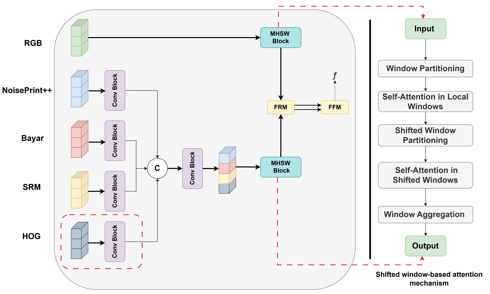

<div align="center">
  
# FUSION++: A Method to Detect Generative AI Manipulated Images
#### BMVC 2024 Workshop on Media Authenticity in the Age of Artificial Intelligence
</div>


Modern-day image manipulation techniques, particularly AI-powered ones, are a significant concern today as they can easily fool the human eyes, leading to the misuse, forgery, and propagation of disinformation by creating deceptive visual content. There is a need to accurately detect manipulation and localization of the manipulated region to identify where manipulation happened in the image. This paper introduces NCL_IMD.v2 a new dataset for AI manipulated images, and a manipulation detection technique, FUSION++, which constitutes progress on state-of-the-art detection algorithms such as MMFUSION. Unique in its kind, the proposed new dataset provides an orderly manipulation technique that uses generative AI and prompts engineering to produce real-like outcomes. The detection algorithm, FUSION++, used an additional HOG-based feature extractor alongside other feature extractors used in MMFUSION and also incorporated a shifted window-based attention mechanism. The results of these integrations showed major performance improvements. FUSION++ consistently produced higher detection and localization performance on both existing datasets, such as AutoSplice and CocoGlide, and the newly introduced dataset, providing a robust solution for AI manipulated visual content.


# 1. Dataset Generation:
 

 - **Image Cropping and Processing**: Automated pipelines for object detection and description.
 - **Segmentation Model**: Mask generation using [Segment Anything (SAM)](https://github.com/facebookresearch/segment-anything).
- **Integration with Transformers**: Leverages `transformers` for advanced AI models.
- **Inpainting**: Provides utilities for inpainting images using generative
AI tools.


## Installation

1. Install requirements:
   ```bash
   pip install -r requirements.txt
   ```

2. Additional setup:
   - Configure OpenAI API:
     ```bash
     export OPENAI_API_KEY="API_KEY"
     ```
   - Download SAM and YOLO models as described in their respective repositories.

3. Install specific libraries:
   ```bash
   pip install diffusers transformers torch torchvision
   ```


## Modules Overview

### Core Scripts
- **`removal_main.py`**: Image manipulation using LaMa / object removal.
- **`sd_main.py`**: Image manipulation using Stable Diffusion / object replacement.
- **`paintByexample_main.py`**: Image manipulation using PaintByexample.
- **`dalle_main.py`**: Image manipulation using OpenAI DALL-E / object replacement.
- **`powerpaint_main.py`**: Image manipulation using PowerPaint.
- **`cre_main.py`**: Object creation .
- **`cre_rem_main.py`**: Combined manipulations, creation and removal.
- **`cre_rep_main.py`**: Combined manipulations, creation and replacement.
- **`rem_rep_main.py`**:  Combined manipulations, removal and replacement.

### Utilities
- **`essentials.py`**: Contains core utilities such as directory creation, API configuration, and debugging tools.
- **`packages.py`**: Handles importing and setting up essential libraries like PyTorch, OpenAI APIs, and image processors.


## Dependencies

Key libraries include:
- Transformers (BLIP)
- Diffusers for Stable Diffusion
- Segment Anything (SAM)
- YOLO for object detection
- Torch, OpenAI API, CV2, and Matplotlib

---

:green_circle: The NCL_IMD.v2 dataset is available for download [here](https://dbhowmik.github.io/MediaTrust/dataset/)

---
# 2. FUSION++ Detection and Localization Method:

 
